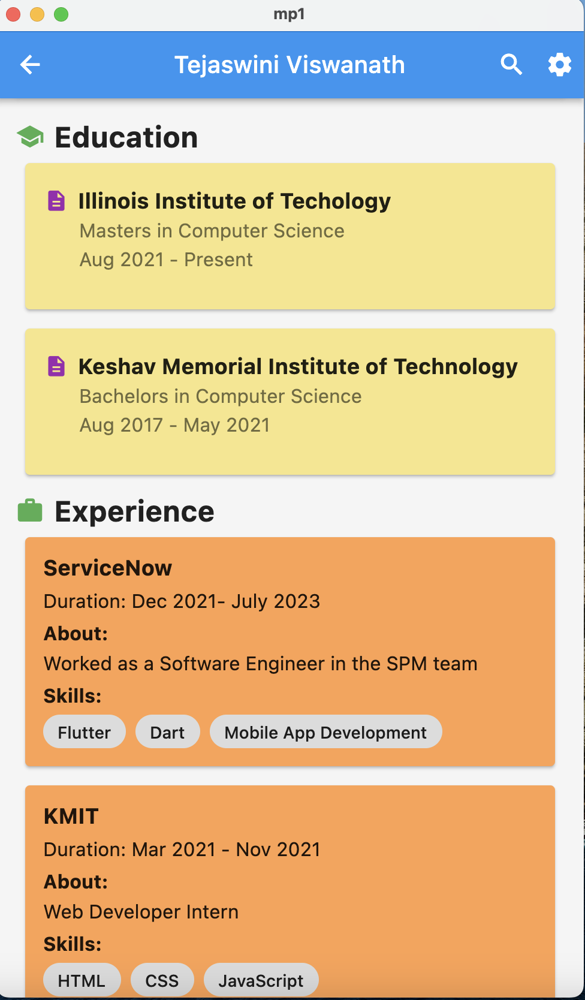
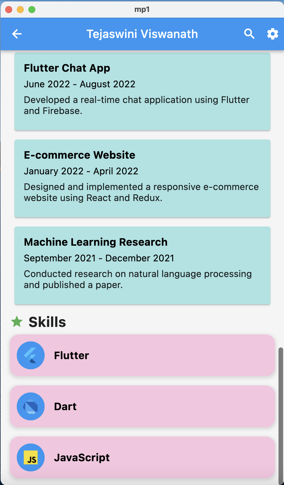

# Profile Page Flutter Application

## Overview

This project aims to experiment with various display and layout widgets available in the Flutter framework. The application displays a single scrollable screen containing static user information, organized into multiple visually distinct sections. These sections align with the theme of a hypothetical social networking application. For instance, a professional networking app might feature sections like "Contact," "Education," and "Projects," while a dating app could include "About Me," "Interests," and "My Photos."

## Specifications

When executed, the application displays a single scrollable screen containing static user information organized into multiple visually distinct sections. These sections must adhere to the following requirements:

- Include a minimum of four distinct sections, with each section visually distinguished using nesting, padding, background colors, or similar techniques.
- Incorporate at least three images.
- Utilize at least one nested row/column widget, where each nested widget contains a minimum of two children.

## Implementation Details

### Project Setup

This repository includes a basic Flutter project structure, which is used as a starting point for the implementation. Only the `lib/main.dart` file needs to be modified, although additional Dart files can be created to organize the code (e.g., for custom widgets or data model classes).

Images used in the app should be added to the `assets/images` directory.

### User Data Model

The layout and content of the page remain static, but the code is structured to separate layout concerns from data. This means avoiding hard-coding the content into the widget classes. Instead, one or more classes represent and store user information, collectively referred to as the data model. Instances of these classes are passed to the widgets for display.

For example, a `UserInfo` class might look like this:

```dart
class UserInfo {
  final String name;
  final String position;
  final String company;
  final String phone;
  final String email;
  final String address1;
  final String address2;

  // each entry is a record with named fields that describe a degree
  final List<({String logo, String name, double gpa})> education;

  // each entry is an instance of `ProjectInfo` that contains project details
  final List<ProjectInfo> projects;
  
  // ... constructor, etc.
}
```

The `main` function might be structured like this:

```dart
void main() {
  // build the user info object
  UserInfo userInfo = UserInfo(
    name: 'John Doe',
    position: 'Software Engineer',
    company: 'ACME Enterprises',
    phone: '(312) 555-1212',
    email: 'john.doe@acme.com',
    address1: '10 W 31st St.'
    address2: 'Chicago, IL 60616'
  );
  userInfo.addEducation(
    logo: 'assets/images/illinois-tech-logo.png',
    name: 'Illinois Tech',
    gpa: 3.8
  );
  // etc.

  // hand the user info object to the root widget
  runApp(MaterialApp(home: UserInfoPage(userInfo: userInfo)));
}
```

### Widget Structure

The widget tree includes at least one instance of each of the following widget types:

- `AppBar`
- `Column`
- `Container`
- `Image`
- `ListView`
- `MaterialApp`
- `Row`
- `Scaffold`
- `SizedBox`
- `Text`

Optional widgets that may be useful/interesting:

- `Card`
- `Expanded`
- `GridView`
- `ListTile`
- `SingleChildScrollView`

It's highly recommended to define more than one custom widget class for better code organization and easier layout changes.

## Testing

Since the page is static, functional testing is unnecessary. However, testing the layout with various window sizes and aspect ratios ensures compatibility and a visually appealing display under all conditions.

## Hints / Tips

- Refer to the [Layout](https://docs.flutter.dev/ui/layout) section and [Building Layouts](https://docs.flutter.dev/ui/layout/tutorial) tutorial for valuable insights into using various layout widgets.
- To include images in the page, place them in the `assets/images` directory of the project. Displaying them is a matter of constructing `Image` widgets with appropriate paths, like this:
  
  ```dart
  Image.asset('assets/images/my-image.png')
  ```

  See the [Adding assets and images](https://flutter.dev/docs/development/ui/assets-and-images) page in the Flutter documentation for more details.
- Utilize VSCode's "Extract Widget" refactoring tool to assist in isolating sections of the code into separate widget classes. This approach is demonstrated in the [Your first Flutter app](https://codelabs.developers.google.com/codelabs/flutter-codelab-first#0) codelab assigned for the previous week.

## Result/Output

Screenshot - 1



Screenshot - 2

